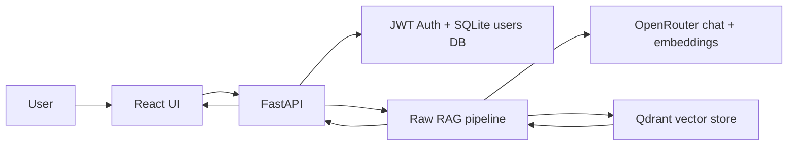

# Privacy Policy Compliance Assistant

Privacy Policy Compliance Assistant is a RAG-based chatbot for asking natural-language questions about privacy policies and compliance rules. Users can ask questions such as "Which policy applies to customer data retention?" or "Which rules conflict between these documents?" and receive grounded answers with inline citations from the source policy passages.

## Demo

- Demo app: [Privacy Policy Compliance Assistant on Hugging Face Spaces](https://huggingface.co/spaces/genti120604/Privacy_Policy_Compliance_Assistant)
- Username: `admin`
- Password: `admin`

> Note: the `admin` / `admin` credentials are provided only for the public demo environment. Do not use these credentials for production or private deployments.

## Key Features

- Natural-language Q&A over a privacy policy corpus.
- Semantic retrieval with Qdrant.
- LLM-generated answers through OpenRouter.
- Inline citations from retrieved source passages.
- Cross-document conflict/comparison detection.
- Optional source filtering.
- JWT-protected UI with Argon2 password hashing.
- Per-user rate limiting.
- React chat interface with citation cards and token refresh handling.
- Docker Compose deployment for local use.
- Hugging Face Docker Space deployment for the public demo.

## Architecture



Main RAG flow:

1. The user submits a question in the web UI.
2. The backend verifies the JWT and applies rate limiting.
3. The question is embedded with `nvidia/llama-nemotron-embed-vl-1b-v2`.
4. Qdrant retrieves relevant passages from the `policies` collection.
5. `google/gemma-4-26b-a4b` generates a grounded answer.
6. The backend verifies citation references against retrieved chunks.
7. The UI streams the answer and displays source citations with retrieval scores.

## Tech Stack

- Backend: Python 3.11, FastAPI, Uvicorn
- LLM and embeddings: OpenRouter via the OpenAI SDK
- Vector store: Qdrant
- Auth: PyJWT, pwdlib Argon2, SQLite
- Frontend: React, Vite, Tailwind CSS
- Optional observability: Phoenix via Docker Compose profile
- Deployment: Docker Compose and Hugging Face Docker Space

## Project Structure

```text
backend/                  FastAPI app, RAG services, auth, ingestion, evals
frontend/                 React/Vite UI
dataset/json/             Privacy policy QA corpus
deploy/huggingface/       Nginx config and startup script for Hugging Face Space
docker-compose.yml        Local multi-service deployment
Dockerfile                Single-container Hugging Face Space image
requirements.txt          Python runtime dependencies
```

## Local Setup with Docker Compose

### 1. Configure environment variables

```bash
cp .env.example .env
```

Update the required values in `.env`:

```env
OPENROUTER_API_KEY=...
JWT_SECRET=generate-a-secret-at-least-32-characters
ADMIN_USERNAME=admin
ADMIN_PASSWORD=change-me-before-production
QDRANT_HOST=localhost
QDRANT_PORT=6333
```

### 2. Install local ingestion dependencies

```bash
python3.11 -m venv .venv
.venv/bin/pip install -r requirements.txt
```

On Windows PowerShell:

```powershell
py -3.11 -m venv .venv
.\.venv\Scripts\pip install -r requirements.txt
```

### 3. Start Qdrant and ingest the corpus

```bash
docker compose up qdrant -d
.venv/bin/python -m backend.ingestion.ingest
```

On Windows PowerShell:

```powershell
docker compose up qdrant -d
.\.venv\Scripts\python -m backend.ingestion.ingest
```

The ingestion script reads the corpus from `dataset/json/`, creates the `policies` collection, probes the embedding dimension from OpenRouter, and upserts policy chunks into Qdrant.

### 4. Run the full stack

```bash
docker compose up --build
```

Default local endpoints:

- Frontend: `http://localhost`
- Backend health check: `http://localhost:8000/health`
- Qdrant: `http://localhost:6333`

Log in with the `ADMIN_USERNAME` and `ADMIN_PASSWORD` values from `.env`.

## Useful Commands

```bash
make qdrant-up
make ingest
make up
make health
make smoke-test
```

Frontend:

```bash
cd frontend
npm install
npm run build
npm test
```

Backend:

```bash
python -m pytest backend/app/tests
python -m compileall -q backend
```

## API Overview

- `POST /auth/login` - log in and receive access and refresh tokens.
- `POST /auth/refresh` - issue a new access token from a refresh token.
- `POST /auth/logout` - stateless logout; the client clears stored tokens.
- `POST /api/chat` - stream an SSE response with `delta`, `done`, and `error` events.
- `GET /api/sources` - list available policy sources; requires auth.
- `GET /health` - liveness check.

Example chat request:

```json
{
  "message": "Which policy applies to customer data retention?",
  "history": [],
  "source_filter": null
}
```

## Hugging Face Space Deployment

This repository includes a Hugging Face Docker Space deployment path. Hugging Face Spaces do not run `docker compose` directly, so the root `Dockerfile` builds the React app, installs the FastAPI backend, copies Qdrant from the official image, and runs Qdrant, FastAPI, and nginx inside a single container on port `7860`.

### Space Settings

Secrets:

- `OPENROUTER_API_KEY`
- `JWT_SECRET` - at least 32 characters
- `ADMIN_PASSWORD`

Variables:

- `ADMIN_USERNAME=admin`
- `QDRANT_HOST=127.0.0.1`
- `QDRANT_PORT=6333`
- `RATE_LIMIT_PER_MINUTE=60`

### Persistence

Enable Hugging Face persistent storage for real use. The Space container stores:

- Qdrant data in `/data/qdrant`
- SQLite users DB in `/data/backend`

Without persistent storage, indexed passages and user accounts are lost when the Space restarts.

### Corpus Data

The Space image does not bundle the source dataset or a Qdrant snapshot. After the first deploy, restore a Qdrant snapshot into `/data/qdrant` or run the ingestion command against attached persistent storage before sharing the app.

### Push to a Space

```bash
huggingface-cli login
huggingface-cli repo create privacy-policy-compliance-assistant --type space --space_sdk docker --private
git remote add hf https://huggingface.co/spaces/<user>/privacy-policy-compliance-assistant
git push hf main
```

## Security Notes

- Never commit `.env` or OpenRouter API keys.
- Change `ADMIN_PASSWORD` for any deployment outside the public demo.
- `JWT_SECRET` must be at least 32 characters.
- The Qdrant `policies` collection uses COSINE distance; if it is created with the wrong metric, delete the collection and ingest again.
- The Nemotron embedding dimension is probed at runtime and should not be hardcoded.
- Ingestion is an offline script and is not run on every backend startup.

## License

No license has been declared yet.
