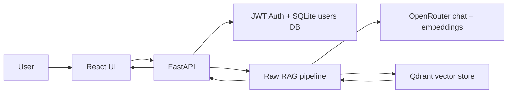

# Privacy Policy Compliance Assistant

Privacy Policy Compliance Assistant is a RAG-based chatbot for asking natural-language questions about privacy policies and compliance rules. Users can ask questions such as "Which policy applies to customer data retention?" or "Which rules conflict between these documents?" and receive grounded answers with inline citations from the source policy passages.

## Demo

- Demo app: [Privacy Policy Compliance Assistant on Hugging Face Spaces](https://huggingface.co/spaces/genti120604/Privacy_Policy_Compliance_Assistant)
- Username: `admin`
- Password: `admin`

> Note: the `admin` / `admin` credentials are provided only for the public demo environment. Do not use these credentials for production or private deployments.

## Key Features

- Natural-language Q&A over a privacy policy corpus.
- Semantic retrieval with Qdrant.
- LLM-generated answers through OpenRouter.
- Inline citations from retrieved source passages.
- Cross-document conflict/comparison detection.
- Optional source filtering.
- JWT-protected UI with Argon2 password hashing.
- Per-user rate limiting.
- React chat interface with citation cards and token refresh handling.
- Docker Compose deployment for local use.
- Hugging Face Docker Space deployment for the public demo.

## Architecture



Main RAG flow:

1. The user submits a question in the web UI.
2. The backend verifies the JWT and applies rate limiting.
3. The question is embedded with `nvidia/llama-nemotron-embed-vl-1b-v2`.
4. Qdrant retrieves relevant passages from the `policies` collection.
5. `google/gemma-4-26b-a4b` generates a grounded answer.
6. The backend verifies citation references against retrieved chunks.
7. The UI streams the answer and displays source citations with retrieval scores.

## Tech Stack

- Backend: Python 3.11, FastAPI, Uvicorn
- LLM and embeddings: OpenRouter via the OpenAI SDK
- Vector store: Qdrant Cloud (pre-indexed; no ingest on deploy)
- Auth: PyJWT, pwdlib Argon2, SQLite
- Frontend: React, Vite, Tailwind CSS
- Optional observability: Phoenix via Docker Compose profile
- Deployment: Docker Compose and Hugging Face Docker Space

## Project Structure

```text
backend/                  FastAPI app, RAG services, auth, ingestion, evals
frontend/                 React/Vite UI
dataset/json/             Privacy policy QA corpus
deploy/huggingface/       Nginx config and startup script for Hugging Face Space
docker-compose.yml        Local multi-service deployment
Dockerfile                Single-container Hugging Face Space image
requirements.txt          Python runtime dependencies
```

## Deploy with Qdrant Cloud (no ingest on deploy)

The app **only reads** from an existing Qdrant Cloud cluster. Index the corpus **once** (see [One-time corpus indexing](#one-time-corpus-indexing)); every later deploy only needs credentials.

### 1. Configure environment variables

```bash
cp .env.example .env
```

Required in `.env` (same values for Docker Compose, bare-metal, and Hugging Face):

```env
OPENROUTER_API_KEY=your-openrouter-key
JWT_SECRET=generate-a-secret-at-least-32-characters
ADMIN_USERNAME=admin
ADMIN_PASSWORD=change-me-before-production
QDRANT_URL=https://your-cluster.us-east.aws.cloud.qdrant.io
QDRANT_API_KEY=your-qdrant-cloud-api-key
```

### 2. Run the stack

```bash
docker compose up --build
```

On startup the backend verifies the Cloud `policies` collection exists and contains points. It does **not** run ingestion or create an empty collection.

Default endpoints:

- Frontend: `http://localhost`
- Liveness: `http://localhost:8000/health`
- Readiness (Qdrant Cloud): `http://localhost:8000/health/ready`

Log in with `ADMIN_USERNAME` / `ADMIN_PASSWORD` from `.env`.

## One-time corpus indexing

Run **only when** the Cloud cluster is new, the collection was deleted, or `dataset/json/` changed:

```bash
python3.11 -m venv .venv
.venv/bin/pip install -r requirements.txt   # Windows: .\.venv\Scripts\pip install -r requirements.txt
python -m backend.ingestion.ingest
```

Optional local Qdrant for indexing (not used at deploy time):

```bash
docker compose --profile local-qdrant up qdrant -d
# .env: QDRANT_URL=http://localhost:6333 and matching QDRANT_API_KEY
python -m backend.ingestion.ingest
```

Ingestion creates the `policies` collection, embeds passages via OpenRouter, and upserts into the cluster pointed to by `QDRANT_URL`.

## Useful Commands

```bash
make up          # deploy app (expects Qdrant Cloud already indexed)
make health      # /health + /health/ready
make smoke-test
make ingest      # one-time indexing only
make qdrant-up   # optional local Qdrant for ingest (--profile local-qdrant)
```

Frontend:

```bash
cd frontend
npm install
npm run build
npm test
```

Backend:

```bash
python -m pytest backend/app/tests
python -m compileall -q backend
```

## API Overview

- `POST /auth/login` - log in and receive access and refresh tokens.
- `POST /auth/refresh` - issue a new access token from a refresh token.
- `POST /auth/logout` - stateless logout; the client clears stored tokens.
- `POST /api/chat` - stream an SSE response with `delta`, `done`, and `error` events.
- `GET /api/sources` - list available policy sources; requires auth.
- `GET /health` - liveness (process up; no Qdrant call).
- `GET /health/ready` - readiness (Qdrant Cloud `policies` collection reachable and non-empty).

Example chat request:

```json
{
  "message": "Which policy applies to customer data retention?",
  "history": [],
  "source_filter": null
}
```

## Hugging Face Space Deployment

The root `Dockerfile` builds the React app, FastAPI backend, and nginx on port `7860`.

**Recommended:** point the Space at the same **Qdrant Cloud** cluster used for local indexing (no ingest on Space restart).

### Space secrets (required)

- `OPENROUTER_API_KEY`
- `JWT_SECRET` — at least 32 characters
- `QDRANT_URL` — your Qdrant Cloud cluster URL
- `QDRANT_API_KEY`
- `ADMIN_PASSWORD`

### Space variables

- `ADMIN_USERNAME=admin`
- `RATE_LIMIT_PER_MINUTE=60`

When `QDRANT_URL` is a Cloud URL, the startup script **does not** start embedded Qdrant. Readiness uses `GET /health/ready` against Cloud.

### Legacy embedded Qdrant (optional)

If `QDRANT_URL` is unset or points to `localhost` / `127.0.0.1`, the Space starts embedded Qdrant under `/data/qdrant`. You must still run **one-time** `python -m backend.ingestion.ingest` against that instance and enable persistent storage, or use Cloud instead.

### Persistence

Enable Hugging Face persistent storage for the SQLite users DB (`/data/backend`). Vector data lives on **Qdrant Cloud** when using Cloud URLs — not in the Space volume.

### Push to a Space

```bash
huggingface-cli login
huggingface-cli repo create privacy-policy-compliance-assistant --type space --space_sdk docker --private
git remote add hf https://huggingface.co/spaces/<user>/privacy-policy-compliance-assistant
git push hf main
```

## Security Notes

- Never commit `.env` or OpenRouter API keys.
- Change `ADMIN_PASSWORD` for any deployment outside the public demo.
- `JWT_SECRET` must be at least 32 characters.
- The Qdrant `policies` collection uses COSINE distance; if it has the wrong metric, delete it on Cloud and run one-time ingestion again.
- Deploy verifies Cloud connectivity at startup; use `/health/ready` for orchestration probes.
- Ingestion (`python -m backend.ingestion.ingest`) is a **one-time offline** step — never part of `docker compose up` or app startup.

## License

No license has been declared yet.
